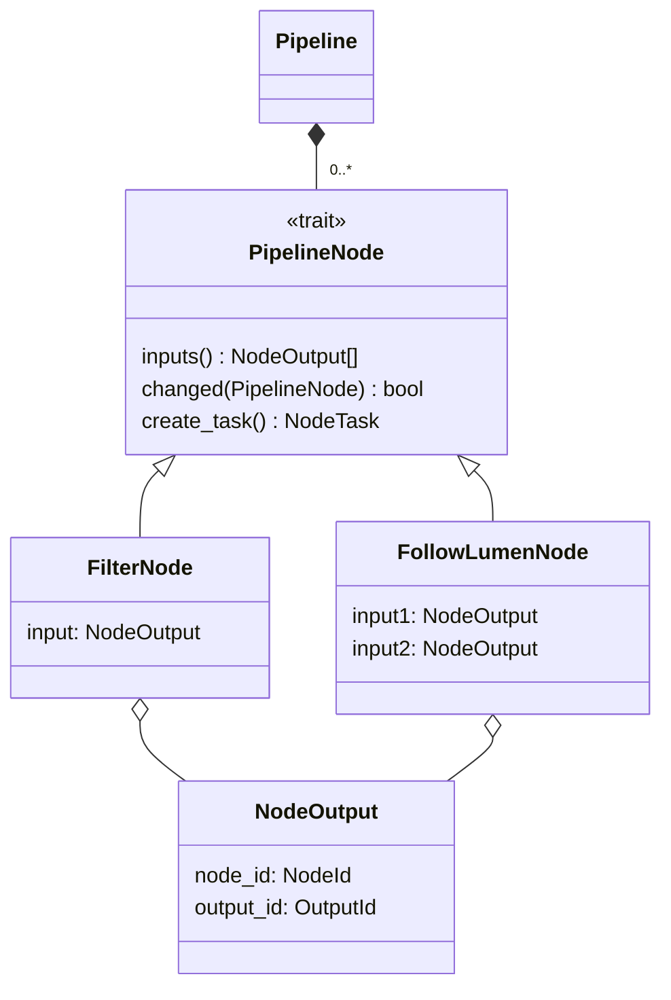

# Technical Overview

## Crates

This project uses [`egui`](https://www.egui.rs/) for it's GUI, together with
[`egui_dock`](https://crates.io/crates/egui_dock) for the docking layout and
[`eframe`](https://crates.io/crates/eframe), which is a simple framework that
handles the setup of `egui` and the application lifecycle.

[`nalgebra`](https://nalgebra.org/) is used for algebraic operations.

[`tokio`](https://tokio.rs/) is used as a concurrent runtime, serving the
backbone of the pipelines execution. `tokio` enables the use of `async`/`await`
operations.

To accomplish advanced parallelism, this project uses
[`rayon`](https://crates.io/crates/rayon). Many algorithms are implemented using
`rayon`s parallel iterators. This means a simple, serial `for` loop without
interdependent iterations is replaced by a parallel iterator, like so:

```rust
let mut data: Vec<f32> = vec![ ... ];
for e in data.iter_mut() {
    *e *= 2.0;
}
```

becomes:

```rust
let mut data: Vec<f32> = vec![ ... ];
data.par_iter_mut()
    .for_each(|e| {
        *e *= 2.0
    });
```

## Main app

The [main entry point](/src/main.rs#L17) uses `eframe` to run the main app
structure.

The [main app](/src/app.rs#L19) consists of the [high level
`Pipeline`](#high-level-pipeline), the [pipelines execution
system](#execution-of-the-pipeline) and the [pipelines editing
state](#editing-of-the-pipeline). As well as a
[`DataViewState`](/src/view/mod.rs#L25), a [`DataViewsManager`] and a
[`ViewsExecutor`]. It also stores the global [`DockState`] and provides a
[`Cache`](/src/cache.rs#L14).

TODO: Fill out links

### Main update cycle

The main update cycle is run in the [`update`](/src/app.rs#L124) method and
consists of the following steps:

1. Render all the UI.
   - In this step also the `Pipeline` description gets updated by the node graph
     editor.
2. Update the `DataViewsState` using the `DataViewsManager` and additional
   information got from the node graph editor.
3. Update the pipeline execution system using the `Pipeline` description.
4. Update the data view execution system using the `DataViewsState`.
5. If the user requested, load a new pipeline.

## Pipeline

### High level [`Pipeline`](/src/pipeline/mod.rs#L56)

The [`Pipeline`](/src/pipeline/mod.rs#L56) structure is only a high level
description, which is easy to modify in an editing environment. It consists of
multiple nodes, each identified by a `NodeId`. Each node has a set of inputs and
outputs, identified by an `InputId` and `OutputId` respectively. Only the input
side knows if it is connected to any output, preventing redundancy and allowing
for multiple inputs connecting to the same output.

Every node is described by the [`PipelineNode`](/src/pipeline/nodes/mod.rs#L51)
trait. Implementers are required to implement methods to test for changes in the
settings, query their inputs, and create a
[`NodeTask`](#execution-of-the-pipeline).

All nodes are implemented [here](/src/pipeline/nodes/).



### Editing of the pipeline

The [`NodeGraphEditor`](/src/gui/node_graph/node_graph_editor.rs#L26) is
completely decoupled from the pipeline. This means it does not know what the
pipeline is. It only knows about a node graph, described using the
[`EditNodeGraph`](/src/gui/node_graph/mod.rs#L75) trait and nodes described by
the [`EditNode`](/src/gui/node_graph/mod.rs#L88) trait.

`EditNodeGraph` defines that in a node graph, nodes can be queried, added and
removed. A node described by `EditNode` defines some visual attributes, as well
as how to connect and disconnect their inputs to outputs. The `EditNode::ui`
method describes the UI of the node in a procedural way, including all inputs,
outputs and all settings a node has.

All nodes are implemented [here](/src/gui/pipeline/nodes/).

### Execution of the pipeline

The execution system is represented by
[`PipelineExecutor`](/src/pipeline/execution/executor.rs#L41). The execution
model is based on concurrent
[`tokio::task`s](https://docs.rs/tokio/latest/tokio/task/). Every node in the
pipeline has an associated task. This task is referred to as a node task and
runs an event loop, which listens to multiple message channels from
[`tokio::sync`](https://docs.rs/tokio/latest/tokio/sync/#message-passing). Some
channels are connected to the `PipelineExecutor`, which sends notices about
configuration changes. Others are connected to other node tasks, to receive and
send data trough the pipeline.

The [`NodeTask`](/src/pipeline/execution/mod.rs#L13) trait describes a specific
nodes task. The implementer must provide methods to connect and disconnect
inputs and sync the task settings with the high level
[`PipelineNode`](#high-level-pipeline). The implementer is also responsible for
implementing the logic to listen to outputs and handle their request. He is free
to use his inputs to request data that is needed to respond to a request.

All nodes are implemented [here](/src/pipeline/nodes/). The implementation of
algorithms is always found at the bottom of the file.

**Algorithm implementations:**

- All filters: [/src/pipeline/nodes/filter.rs (line 490)](/src/pipeline/nodes/filter.rs#L490)
- Follow lumen: [/src/pipeline/nodes/follow_lumen.rs (line 371)](/src/pipeline/nodes/follow_lumen.rs#L371)
- Follow catheter: [/src/pipeline/nodes/follow_catheter.rs (line 327)](/src/pipeline/nodes/follow_catheter.rs#L327)
- Generate mesh: [/src/pipeline/nodes/generate_mesh.rs (line 249)](/src/pipeline/nodes/generate_mesh.rs#L249)
- Calculate diameter: [/src/pipeline/nodes/diameter.rs (line 228)](/src/pipeline/nodes/diameter.rs#L228)
- Process raw M scan
  - Processing: [/src/pipeline/nodes/process_raw_m_scan.rs (line 472)](/src/pipeline/nodes/process_raw_m_scan.rs#L472)
  - Rescaling: [/src/pipeline/nodes/process_raw_m_scan.rs (line 258)](/src/pipeline/nodes/process_raw_m_scan.rs#L258)
- Remove detector offset: [/src/pipeline/nodes/remove_detector_defect.rs (line 156)](/src/pipeline/nodes/remove_detector_defect.rs#L156)
- Segment B scan: [/src/pipeline/nodes/segment_b_scans.rs (line 241)](/src/pipeline/nodes/segment_b_scans.rs#L241)
