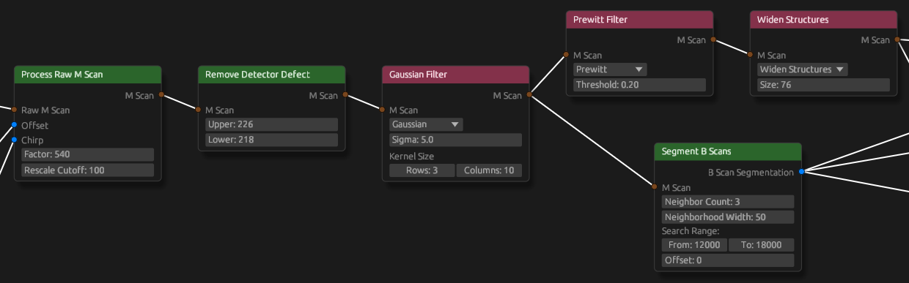

# Application tutorial

## Prerequisites

- [Running application](../README.md)
- Scan files
  - Download from [here](https://collaborating.tuhh.de/cem9903/ems_sose24_ivoct_testing/-/packages/743)
  - Can also be created from MATLAB data by writing it to raw binary (`fwrite(<file>, <data>, "uint16")`). Precision can be
    - `"uint8"`
    - `"uint16"`
    - `"uint32"`
    - `"uint64"`
    - `"float"`
    - `"double"`
  - includes
    - chirp.bin
    - offset.bin
    - phantom1_1_3.dat (raw scan)
    - phantom1_2_4.dat (raw scan)
    - mscan_clinic.dat (processed scan)

## Phantom 1 1 3

When first opening the application, you are greeted with a pipeline tuned for
the `phantom1_1_3.dat` scan. Navigate the pipeline with scrolling for scaling
and holding the mouse wheel for panning.

### Pipeline input

On the left end of the pipeline you can see three orange "Binary Input" nodes.
The top one is set to "Raw M Scan" and its output is brown and is connected to a
node, accepting brown connections as input. The top node also has a path input
field that is currently empty. Click on the three dots next to it to select the
`phantom1_1_3.dat` file. Also select the correct data type of this file from the
dropdown. If you downloaded the scan files from the package registry, the
default values are already correct.

The other two nodes are set to "Data Vector". They have blue outputs, which are
connected to the blue inputs of the next node. One of them is connected to the
"Offset" input, while the other is connected to the chirp input of that node.
Their path input fields are again empty. Also open the correct files as you did
before. If you double click on one of these two nodes, it will open a plot of
the data provided. You can close it again with the x at the top of the tab.


### Preprocessing

when you double click on the "Process Raw M Scan" node, it will begin to process
the provided scan instantly and open the result in a new tab. You can navigate
this tab the same way as you navigate the pipeline. Additionally, you have the
option to choose a different color map at the top left. When you double click on
the next node, called "Remove Detector Defect", you can see how the horizontal
line in the scan vanishes.

When you hold the right mouse button and drag in the pipeline, you draw a dashed
line. This line acts as a cutting tool to cut connections. Draw this line over
the connection from the chirp input node to the "Process Raw M Scan" node. You
can see how the output of the currently viewed node instantly regenerates, but
this time without the de-chirping in the raw processing step. This output looks
quite distorted, so quickly connect the chirp back, by dragging from the output
of the chirp input node to the input of the "Process Raw M Scan" node.




### Data generation

Next in the chain is a Gaussian filter, which blurs the scan slightly to reduce
it's high frequency noise. The output of this node is connected to two nodes.
One of them is a "Segment B Scans" node. When you double click this one, the
view tab now shows more information. It draws the boundaries of the B scans into
the polar view of the scan, we are already familiar with. Additionally, there is
now a cartesian view of each B scan on the right side of the tab. You can scroll
through each scan using the scroll wheel. In the top left of the tab is a
dropdown, where you can choose between the current polar view and the side view.
The side view shows a slice through the length of the scanned vessel in
cartesian coordinates. You can scroll through every angle using the scroll
wheel. The blue lines at the top and bottom show what slice the other view
currently shows.

When you double click the next node, "Follow Catheter", you will see how it
finds the border of the catheter in the scan and it is shown in all three views
of the scan. When double clicking on the "Follow Lumen" node, you can now see
the border of the vessel, also called Lumen, in all views of the scan.

One of the next nodes is the "Diameter" node. It calculates the minimum and
maximum diameter for each B scan. When viewing it, the cartesian view shows
these diameters. The other node is the "Generate Mesh" node. When viewing it, it
opens a completely new data view, where it renders the Lumen in 3D space. It has
the correct physical dimensions. Navigate this view by holding either mouse
button over the view and at the same time using `wasd`, `q` and `e` to move
around. Hold `Ctrl` to increase your speed. You can also scroll to move forwards
and backwards.


### Save data to file

Right click on the background in the pipeline editor to create a new node. Find
the "Output" node under "In Out" and place it behind the "Diameter" node. You
can connect any output in the pipeline to this node. For now, connect the
"Diameter" node to it. You should see the color of the input becoming the color
of the connected output. Now select a path where you want to save this data to.
Make sure the file ending is `.txt`. Now press on `save`. After a little wait,
the file should be created and contains the diameters of all B scans, similar to
the following:

```
1, 2.1791291 mm, 2.4740362 mm
2, 2.1705334 mm, 2.5022485 mm
3, 2.1467817 mm, 2.5056663 mm
4, 2.1524332 mm, 2.5000124 mm
5, 2.110989 mm, 2.4667091 mm
6, 2.1435058 mm, 2.4014518 mm
7, 1.9389035 mm, 2.2696617 mm
...
```

Now you can connect the "Output" node to the "Generate Mesh" node and choose a
file with file ending `.obj`. When pressing save, it will write the 3D model to
disk. You can view it in your favorite 3D model viewer.

## M Scan Clinic

In the top left of the pipeline editor you can press on `File` -> `Presets` ->
`Clinic`. This opens the pipeline tuned for the `mscan_clinic.dat` scan. This
pipeline does not have the "Process Raw M Scan" node, because `mscan_clinic.dat`
is already processed. Again, specify the correct path in the "Binary Input"
node. Notice how this node is set to "M scan". You can double click this node to view
the scan.

You can directly double click on the "Segment B Scans" and "Follow Lumen" nodes
to view the result of these nodes.

To view the diameters of the B scans, add the "Diameters" node, by right
clicking on the background. Find the node under "Process" and place it at the
end of the pipeline. Connect the inputs to the right outputs and double click on
it. Similarly add the "Generate Mesh" node.
